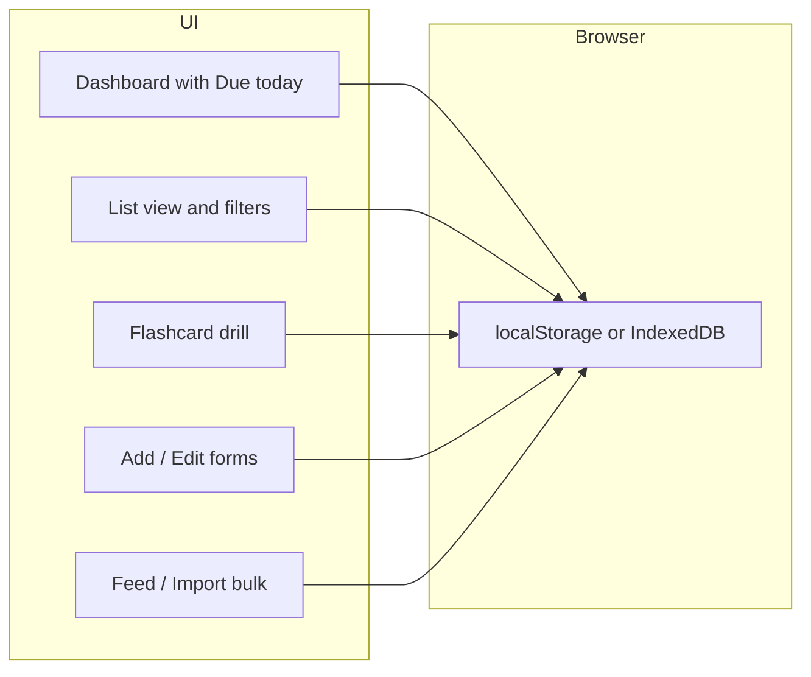

# Japanese Learning Review Tool (Web App)

## Goal

A single place to review grammar, vocabulary, and sentences from your JFBP lessons, with list-based browsing, optional flashcard drill (spaced repetition), and in-app reminders so you see what’s due when you open the app.

---

## Core features

| Area           | What you get                                                                                                                                                                                                                                                                                                                                                                                                                                                              |
| -------------- | ------------------------------------------------------------------------------------------------------------------------------------------------------------------------------------------------------------------------------------------------------------------------------------------------------------------------------------------------------------------------------------------------------------------------------------------------------------------------- |
| **Storage**    | Add and edit grammar points, vocabulary items, and example sentences. Optionally tag or group by lesson/chapter (e.g. “Lesson 5”) to match JFBP.                                                                                                                                                                                                                                                                                                                          |
| **List view**  | Browse all items by type (grammar / vocab / sentences) and filter by lesson and tag. Use as a quick reference and to review in order.                                                                                                                                                                                                                                                                                                                                     |
| **Flashcards** | Optional drill mode with simple spaced repetition (e.g. “again / good / easy”) so items you struggle with show up more often.                                                                                                                                                                                                                                                                                                                                             |
| **Reminders**  | On app load, show a **Due today** section: items whose next review date is today (or overdue). Click through to start a short flashcard session or open the list.                                                                                                                                                                                                                                                                                                         |
| **Feed input** | Bulk input to add study resources in one go: paste text (e.g. one item per line or in a simple delimiter format) or upload a file (CSV, JSON, plain text, or PDF). Choose type (grammar / vocab / sentence) and optional lesson; app parses or lets you map columns, then saves all items. Optional **JapanDict integration**: look up vocabulary to auto-fill meaning and reading; link to [JapanDict](https://www.japandict.com/) for full entry and verb conjugations. |

No login required for v1: data stays in your browser (e.g. `localStorage` or IndexedDB).

---

## Data model (in-browser)

- **Grammar**: id, title, explanation, example sentence (and translation), lesson/chapter, created date, optional SRS fields (next review, interval).
- **Vocabulary**: id, word (kanji/kana), reading (e.g. furigana), meaning, example sentence, lesson, created, SRS fields. Optional: conjugationSummary (text or link) for verbs.
- **Sentences**: id, Japanese text, translation, linked grammar or “standalone”, lesson, created, SRS fields.

SRS fields (for flashcards): `nextReviewAt` (date), `interval` (number of days), `easeFactor`, so the app can compute “due today” and order flashcard sessions.

---

## High-level architecture

- **Dashboard**: “Due today” list (from SRS), quick stats, and links to “Review now” (flashcards) and “Browse all” (list).
- **List view**: Tabs or filters for Grammar / Vocab / Sentences; filter by lesson; search.
- **Flashcard flow**: Choose deck (e.g. “vocab due today” or “all lesson 5”). Show front/back; buttons Again / Good / Easy; update `nextReviewAt` and `interval` (simple SM-2 or similar).
- **Add/Edit**: Forms for grammar, vocab, and sentences; optional lesson selector; new items get `nextReviewAt = today` so they appear in Due today.
- **Feed input**: Dedicated page or section to “feed” resources in bulk (see below).

---

## Feed study resources (bulk input)

An **input function** lets you add many grammar points, vocabulary items, or sentences at once instead of one-by-one.

**Ways to feed data:**

1. **Paste**
  - Large text area: paste a list (e.g. from notes, textbook notes, or a spreadsheet copied as text).  
  - You choose **type** (Grammar / Vocab / Sentences) and optional **lesson**.  
  - **Format options** (one of):  
    - **Line-by-line**: one item per line; for vocab, support a simple delimiter per line (e.g. `word \t reading \t meaning` or `word | meaning`).  
    - **CSV-like**: first line = headers (e.g. `word,reading,meaning`); app maps columns to the chosen type and imports rows.
2. **File upload**
  - Support **.csv**, **.json**, **.txt**, and **.pdf**.
  - **CSV**: Same as paste (headers + rows); user maps “which column is word / reading / meaning / example” for vocab, or equivalent for grammar/sentences.  
  - **JSON**: Accept an array of objects matching the app’s Grammar/Vocab/Sentence shape (or a simple variant); user picks type and optional lesson, then import.  
  - **.txt**: Treated like pasted text (line-by-line or one block); user chooses type and optional lesson; optional simple delimiter (tab/comma) for parsing lines.
  - **.pdf**: Extract text in the browser (e.g. via pdf.js); then treat the extracted text like pasted content—user chooses type and optional lesson, same line-by-line or delimiter parsing as .txt.

**Flow:**  

- Navigate to “Feed resources” or “Import” from dashboard or Add menu.  
- Choose type (Grammar / Vocab / Sentences) and optional lesson.  
- Either paste into a text area or pick a file.  
- If CSV or structured format: show column mapping (e.g. “Column A → Word, Column B → Reading”).  
- Preview parsed items (first few rows) and [Confirm import].  
- Save all items to storage; new items get `nextReviewAt = today` so they appear in Due today.

This keeps manual Add/Edit for single items and adds a clear way to **feed** larger sets of study resources from your notes or exports.

---

## JapanDict integration (vocabulary lookup and conjugations)

Connect the tool with [JapanDict](https://www.japandict.com/) so that vocabulary you input can be **parsed** for meaning and **verb conjugations**, and so you can open any word on JapanDict for full details.

**Important:** JapanDict does not offer a public API ([see their FAQ](https://www.japandict.com/faq)). The plan therefore combines:

1. **Auto-fill meaning and reading**
  Use a free dictionary API (e.g. [Jisho.org API](https://jisho.org/api/v1/search/words?keyword=)) to look up each word when you add or import vocabulary. The app fills in **meaning** and **reading** from the API response. This gives you "parsed" vocabulary without manual entry.
2. **Link to JapanDict**
  For every vocabulary item (in the list, on flashcards, and in the Add/Edit form), show an **"Open in JapanDict"** (or "View on JapanDict") link that opens the word on JapanDict, e.g.  
   `https://www.japandict.com/?word=<word>`  
   There you get the full entry, example sentences, and **verb conjugation tables** (non-past, past, て-form, potential, passive, etc.). So the tool stays "connected" to JapanDict for meanings and conjugations even though the site has no API.
3. **Verb conjugations in the app**
  Jisho's and JapanDict's APIs do not expose conjugation tables programmatically. So:
  - **In-app:** Optionally show a short conjugation summary (e.g. dictionary form + "View full conjugations") and rely on the **"Open in JapanDict"** link for the full table, or add a small client-side conjugation helper (e.g. a JS library or simple rules for common forms) later if desired.
  - **Primary source for conjugations:** JapanDict via the link.

**Where it applies**

- **Single Add:** When adding one vocab item, optional "Look up" button to call Jisho API and fill meaning/reading; show "Open in JapanDict" link.
- **Feed/Import:** When importing a list of words (paste or file), optional "Look up all" step using Jisho API to batch fill meanings and readings; each saved vocab item gets an "Open in JapanDict" link.
- **List and flashcard view:** Each vocab entry shows "Open in JapanDict" so you can quickly open the word on JapanDict to see meaning and verb conjugations.

---

## Tech stack (recommendation)

- **Frontend**: React (Vite) or Next.js (App Router). Vite + React keeps v1 simple and deployable as static (e.g. GitHub Pages, Netlify).
- **Persistence**: **localStorage** for v1 (simple, no backend). If you later want more capacity or structure, swap to **IndexedDB** (e.g. via `idb` or Dexie) without changing the rest of the app much.
- **Routing**: React Router (if Vite) or Next.js file-based routes for: `/`, `/list`, `/flashcards`, `/add`, `/feed` (or `/import`), and `/edit/:id` if you want dedicated edit pages.
- **Styling**: Tailwind CSS or plain CSS modules so the UI is clear and works on mobile and desktop.

No backend or database server for v1: everything runs in the browser.

---

## UI flow (concise)

1. **Open app** → Dashboard: “You have 12 items due today” + list of those items + [Review now] and [Browse all].
2. **Browse all** → List view: filter by type (grammar/vocab/sentences) and lesson; click item to expand or edit.
3. **Review now** → Flashcard session: show cards due today (or chosen deck); After rate (Again/Good/Easy), schedule next review and return to dashboard or list.
4. **Add** → Form (grammar / vocab / sentence); save to storage; for vocab, optional "Look up" fills meaning/reading via Jisho and "Open in JapanDict" link; new items appear in Due today by default.
5. **Feed resources** → Paste a list or upload CSV/JSON/txt/PDF; choose type and lesson; optional "Look up" vocabulary via Jisho to fill meanings/readings; map columns if needed; preview and import; all new items appear in Due today; each vocab has "Open in JapanDict" link.

---

## File structure (example for Vite + React)

- `src/`
  - `data/` or `store/`: storage helpers (read/write grammar, vocab, sentences to localStorage/IndexedDB), SRS logic (next review date, intervals).
  - `services/` or `api/`: Jisho (or similar) dictionary lookup for vocabulary meaning/reading; helper to build JapanDict URL for a word.
  - `components/`: Dashboard, ListView, FlashcardSession, AddEditForm(s), DueToday.
  - `pages/` or routes: Home (dashboard), List, Flashcards, Add, Feed (import).
  - `hooks/`: e.g. `useDueToday()`, `useItems()`.
  - `types/`: TypeScript types for Grammar, Vocab, Sentence.
- `public/`: favicon, etc.

---

## Implementation order

1. **Project setup**: Vite + React + TypeScript + router + Tailwind (or CSS); define types for grammar, vocab, sentence and a simple storage layer (localStorage).
2. **CRUD + list**: Add/Edit forms and list view with filters (type, lesson); persist and read from storage.
3. **SRS + Due today**: Add SRS fields to model; compute “due today”; Dashboard with Due today list and “Review now” entry point.
4. **Flashcards**: Flashcard UI (front/back, Again/Good/Easy), wire to SRS so next review dates and intervals update; optional deck selection (e.g. due only vs by lesson).
5. **Feed/Import**: Feed input page: paste area + file upload (CSV, JSON, txt, PDF); type + lesson selector; line-based or CSV parsing with column mapping; for PDF, extract text in-browser (e.g. pdf.js) then parse like pasted text; preview and bulk save.
6. **JapanDict integration**: Jisho API client for vocabulary lookup (meaning, reading); "Look up" / "Look up all" in Add and Feed; "Open in JapanDict" link on every vocab entry (list, flashcard, form); optional conjugation note or link for verbs.
7. **Polish**: Mobile-friendly layout, clear labels (e.g. "Grammar", "Vocab", "Sentences"), and any copy that matches "Japanese for Busy People 2" (e.g. "Lesson" in filters). Mobile-friendly layout, clear labels (e.g. “Grammar”, “Vocab”, “Sentences”), and any copy that matches “Japanese for Busy People 2” (e.g. “Lesson” in filters).

---

## Optional later enhancements

- Export/import (JSON) so you can back up or move data.
- Optional grouping by “JFBP Lesson 1, 2, …” in the list and in flashcards.
- Dark/light theme toggle.

This gives you a single, focused place to review JFBP grammar, vocabulary, and sentences, with list reference, optional spaced repetition, and in-app reminders via the Due today section when you open the app.