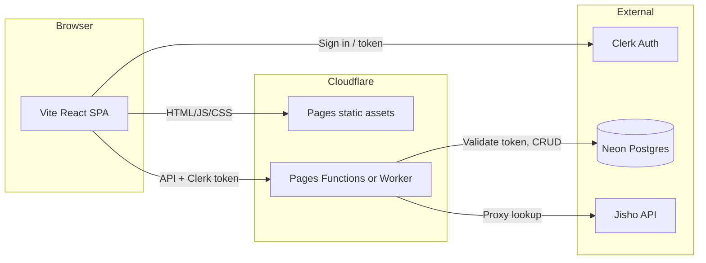

# Japanese Learning Review Tool — Plan Update and Production Upgrade

## Part 1: Updates to reflect current implementation

The following changes have been implemented since the original plan. The plan document should be updated so it accurately describes the current app.

### Data model (current)

- **Grammar**: Unchanged (id, title, explanation, example sentence/translation, lesson, created, SRS).
- **Vocabulary**: Now includes **VerbConjugation** (six optional string fields): `present`, `negative`, `past`, `pastNegative`, `teForm`, `taiForm`. Stored under `Vocabulary.conjugation`. No "category" or single "conjugationForm" field. See [src/types/index.ts](src/types/index.ts).
- **Sentences**: Unchanged.

### JapanDict and Jisho (current)

- **JapanDict**: No public API. The app links to JapanDict using **search URL** `https://www.japandict.com/?s=<word>&lang=eng&list=1` (not `?word=`), so "Open in JapanDict" opens search results for that word.
- **Jisho**: Used for meaning/reading lookup. Because the Jisho API does not allow browser CORS, the app calls it via a **Vite dev-server proxy** in [vite.config.ts](vite.config.ts) (`/api/jisho` → `jisho.org/api/v1/search/words`). Lookup fills **meaning** and **reading**; conjugation fields are not provided by Jisho and remain user-editable. See [src/services/jisho.ts](src/services/jisho.ts).

### Add flow (current)

- **Home**: Dashboard has an **"Add"** button (first CTA) linking to `/add`, plus "Review now" and "Browse all."
- **Add Vocab**: No "Category" section. A **"Verb Conjugation"** section with **six editable inputs** (Present, Negative, Past, Past Negative, Te-form, Tai-form) is shown; lookup can auto-fill meaning/reading only; all six conjugation fields are editable and saved with the vocab item.

### List and Edit (current)

- **List**: No "Vocab category" or "Conjugation form" filters. Vocab items that have any conjugation fields saved display a **"Verb conjugation"** block (label + list of present forms). Edit opens a form that includes the same six conjugation inputs.
- **Storage**: All data is in **localStorage** under keys `jfbp_grammar`, `jfbp_vocab`, `jfbp_sentences`. See [src/store/storage.ts](src/store/storage.ts).

### Flashcards (current)

- **Flip state**: Reset to front whenever the card **index** changes (e.g. next card), so each card starts showing the front.
- **Vocab front**: Shows **only the word** (and type badge); reading is not shown on the front.
- **Vocab back**: Shows **word**, **reading**, **meaning**, any **verb conjugation** fields that are present, and the "Open in JapanDict" link.

### Other implemented details

- **Error boundary**: [src/ErrorBoundary.tsx](src/ErrorBoundary.tsx) wraps the app to show a friendly error message instead of a blank screen if a component throws.
- **Requirements**: README states Node 18+ and documents that the Jisho proxy is used for lookup; running on older Node causes the dev server to fail (e.g. `Unexpected token '??='`).

---

## Part 2: Production upgrade — Cloudflare Pages, Neon, Clerk

Goal: Move from a local prototype (localStorage, no auth) to a production-ready stack so multiple users can sign in and have their data stored permanently and securely.

### Target architecture

- **Hosting**: Cloudflare Pages serves the built Vite app (static).
- **API**: Cloudflare Pages Functions (or a Cloudflare Worker) provides REST endpoints for grammar, vocab, and sentences; validates Clerk session/JWT and scopes all data by `userId`.
- **Database**: Neon Postgres holds one schema with tables for grammar, vocab, sentences, each with `user_id` (Clerk user id); optional `users` table keyed by Clerk id for profile/metadata if needed.
- **Auth**: Clerk handles sign-up, sign-in, and session. Frontend uses Clerk components and sends the session token (e.g. in `Authorization` header) to the API; API verifies the token and uses the subject as `user_id`.

### 1. Cloudflare Pages (hosting)

- **Build**: Use the existing Vite build (`npm run build`). Configure the Pages project to build command `npm run build` and output directory `dist`.
- **Environment**: Set env vars in Pages dashboard for production (e.g. `VITE_CLERK_PUBLISHABLE_KEY`, and any public API base URL). Backend secrets (Neon connection string, Clerk secret key) are not needed in the frontend; they are used only by the API (Functions/Worker).
- **Jisho in production**: The current Vite proxy only works in dev. In production, either (a) implement a **Pages Function** or **Worker** route that proxies `GET /api/jisho?keyword=...` to Jisho and returns the JSON, and point the frontend to that same path, or (b) call that proxy URL from the frontend if the API is on the same origin (e.g. `/.netlify/functions/...`-style or `/api/...` on Pages).

### 2. Neon (Postgres database)

- **Schema**: Create tables that mirror the current types, with an added `user_id` column (e.g. `TEXT` or `UUID`, from Clerk).
  - **grammar**: id (UUID), user_id, type, title, explanation, example_sentence, example_translation, lesson, created_at, next_review_at, interval, ease_factor.
  - **vocab**: id, user_id, word, reading, meaning, example_sentence, lesson, created_at, next_review_at, interval, ease_factor, plus columns for conjugation (present, negative, past, past_negative, te_form, tai_form) or a single JSONB column `conjugation`.
  - **sentences**: id, user_id, japanese_text, translation, linked_grammar, lesson, created_at, SRS fields.
- **Access**: Use the **Neon serverless driver** (or `pg` with connection pooling) from the Cloudflare API. Neon supports serverless and provides a connection string; use it only in server-side code (Pages Function or Worker). Apply migrations (e.g. via a small script or Neon’s SQL editor) to create tables and indexes (e.g. on `user_id`, `next_review_at` for due-today queries).

### 3. Clerk (authentication)

- **Setup**: Create a Clerk application; get publishable key (for frontend) and secret key (for API). Configure sign-in/sign-up (e.g. email + password or OAuth).
- **Frontend**: Wrap the app in `ClerkProvider`; use `SignedIn` / `SignedOut` to show either the main app or a sign-in/sign-up UI. Use `useAuth()` or similar to get the session token and attach it to API requests (e.g. `Authorization: Bearer <token>`). Optionally protect routes so unauthenticated users are redirected to sign-in.
- **API**: In each request handler, read the `Authorization` header, verify the JWT with Clerk’s secret (or Clerk’s backend SDK), and use the token’s subject (Clerk user id) as `user_id` for all DB reads/writes. Do not trust the client for `user_id`.

### 4. API layer (Cloudflare Pages Functions or Worker)

- **Purpose**: Replace direct localStorage usage with HTTP calls. The frontend continues to use the same logical operations (get grammar/vocab/sentences, create, update, delete, bulk add) but implemented via fetch to the API.
- **Endpoints (suggested)**:
  - `GET /api/grammar`, `GET /api/vocab`, `GET /api/sentences` — return lists for the authenticated user.
  - `POST /api/grammar`, `POST /api/vocab`, `POST /api/sentences` — create; body matches current item shape (with optional conjugation for vocab).
  - `PATCH /api/grammar/:id`, `PATCH /api/vocab/:id`, `PATCH /api/sentences/:id` — update.
  - `DELETE /api/grammar/:id`, etc. — delete.
  - `POST /api/vocab/bulk`, etc. — bulk create for Feed/Import.
  - `GET /api/jisho?keyword=...` — proxy to Jisho; return JSON (so production works without CORS).
- **Implementation**: Use Pages Functions (under `/functions` in the repo) or a single Worker that routes by path. Parse JSON body where needed; validate Clerk JWT; run SQL against Neon (parameterized) and return JSON. Use Neon’s serverless driver in this serverless context.

### 5. Frontend migration (from localStorage to API)

- **Storage abstraction**: Introduce a **data layer** (e.g. `src/api/client.ts` or `src/store/apiStorage.ts`) that implements the same logical interface as the current [src/store/storage.ts](src/store/storage.ts) (getGrammar, getVocab, getSentences, createVocab, updateVocab, etc.) but calls the new API with the Clerk token. Optionally keep the existing storage module and switch implementation via env (e.g. `VITE_USE_API=true`) or dependency injection so dev can still use localStorage during development.
- **Auth UI**: Add sign-in/sign-up page(s) and wrap the app with Clerk; show "Due today", List, Flashcards, Add, Feed only when signed in.
- **No localStorage for persistence**: Once the API is used, do not persist the main data to localStorage for production; use the API as the single source of truth. (Optional: cache or offline support can be a later enhancement.)

### 6. Implementation order (production)

1. **Neon**: Create project, run migrations for grammar, vocab, sentences (with user_id and conjugation fields).
2. **Clerk**: Create application, add keys to env; integrate ClerkProvider and sign-in/sign-up in the frontend; protect routes.
3. **API**: Implement Pages Functions (or Worker) with auth check and Neon; expose CRUD and bulk endpoints and Jisho proxy.
4. **Frontend**: Add API client that uses Clerk token; swap storage usage to API client for production (or feature flag).
5. **Cloudflare Pages**: Connect repo, set build and env; deploy. Configure API so the SPA and API share the same origin or CORS if needed.
6. **Testing**: Sign up, create items, verify they are stored in Neon and scoped by user; test Feed/Import, Flashcards, and Look up (Jisho proxy).

### 7. Cost notes

- **Cloudflare Pages**: Free tier is generous for static and Functions.
- **Neon**: Free tier includes a small Postgres instance and branching; sufficient for early public launch.
- **Clerk**: Free tier typically includes a limited number of monthly active users; sufficient to start.

---

## Summary

- **Part 1** brings the written plan in line with the current app: Verb Conjugation (six fields), JapanDict link format, Jisho proxy, Add button, List/Edit/Flashcards behavior, and localStorage as the only storage.
- **Part 2** defines the production upgrade: deploy the same frontend to **Cloudflare Pages**, add an **API** (Pages Functions or Worker) that uses **Clerk** for auth and **Neon** for Postgres, and migrate the frontend from localStorage to the API so data is per-user and persistent.