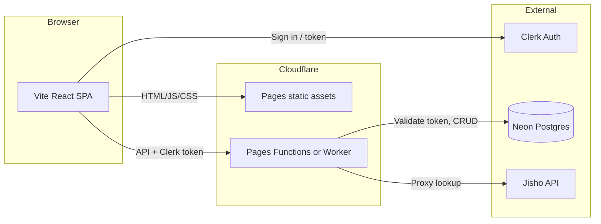

# Japanese Learning Review Tool — Plan Update and Production Upgrade

## 1. Current implementation

This section describes everything the app does now. It is the single source of truth for “what exists.”

### Data model

- **Grammar**: id, type, title, explanation, example sentence/translation, lesson, created, SRS. See [src/types/index.ts](src/types/index.ts).
- **Vocabulary**: Same as above plus **VerbConjugation** (six optional string fields): `present`, `negative`, `past`, `pastNegative`, `teForm`, `taiForm`, stored under `Vocabulary.conjugation`. No category or single conjugationForm field.
- **Sentences**: id, type, japaneseText, translation, linkedGrammar, lesson, created, SRS.

### Storage

- **Local (default)**: When `VITE_USE_API` is not set, data lives in **localStorage** under `jfbp_grammar`, `jfbp_vocab`, `jfbp_sentences`. See [src/store/storage.ts](src/store/storage.ts).
- **Production**: When `VITE_USE_API=true`, the app uses the **API** with the Clerk session token. [src/store/StorageContext.tsx](src/store/StorageContext.tsx) provides `StorageProvider` and `useStorage()`; [src/api/client.ts](src/api/client.ts) and [src/store/localStorageAdapter.ts](src/store/localStorageAdapter.ts) implement the same interface (async). Add, List, Flashcards use async storage; [useItems](src/hooks/useItems.ts) and [useDueToday](src/hooks/useDueToday.ts) load from storage and expose `loading`.

### Auth

- **When Clerk is configured** (`VITE_CLERK_PUBLISHABLE_KEY` set): App is wrapped in `ClerkProvider`. Sign-in/sign-up at `/sign-in` and `/sign-up`; unauthenticated users are redirected to sign-in. Session token is sent as `Authorization: Bearer <token>` on API requests. `useAuthToken()` exposes getToken for authenticated lookups (e.g. Jisho).
- **When Clerk is not set**: App runs without auth; storage is localStorage only.

### Jisho lookup

- **Purpose**: Fill **meaning** and **reading** for vocabulary; conjugation is not provided by Jisho and stays user-editable.
- **Dev**: Vite proxy in [vite.config.ts](vite.config.ts) forwards `/api/jisho` to `jisho.org/api/v1/search/words`.
- **Production**: Same path `/api/jisho` is served by a Pages Function that proxies to Jisho (auth required). See [functions/api/[[path]].ts](functions/api/[[path]].ts) `handleJisho`.
- **Token**: Add page (AddVocabForm) passes `useAuthToken()` into `lookupJisho(keyword, getToken)` so production requests are authenticated. See [src/services/jisho.ts](src/services/jisho.ts).
- **Retries**: Up to 3 attempts with 600ms delay when response is 5xx or 525; one retry on network throw.
- **Fallback**: If `/api/jisho` still returns 525 or 502–504 after retries, the frontend tries one request via a public CORS proxy ([api.allorigins.win](https://api.allorigins.win)) to Jisho; on success the result is used.
- **Errors**: `JishoLookupError` with distinct messages (401 sign in, 429 rate limit, 525/502–504 temporarily unavailable, network/timeout). Add page shows `err.message`; “Word not found” when Jisho returns empty data.
- **API proxy**: 12s timeout, checks `res.ok`, returns clear errors for 429 and 5xx.

### JapanDict

- No public API. “Open in JapanDict” uses search URL `https://www.japandict.com/?s=<word>&lang=eng&list=1`. See [src/services/jisho.ts](src/services/jisho.ts) `getJapanDictUrl`.

### Pages and flows

- **Home**: Dashboard with “Due today” count; “Add” (first CTA), “Review now”, “Browse all”. See [src/pages/Home.tsx](src/pages/Home.tsx).
- **Add** (`/add`): Single grammar, vocab, or sentence. Vocab has six verb-conjugation inputs and “Look up” (Jisho) + “Open in JapanDict”. See [src/pages/Add.tsx](src/pages/Add.tsx).
- **List** (`/list`): Browse all with filters by type and lesson. Vocab shows a “Verb conjugation” block when present. Edit opens a form with the same six conjugation inputs; **save error feedback** (red message) when update fails. See [src/pages/List.tsx](src/pages/List.tsx).
- **Flashcards** (`/flashcards`): Deck “Due today” or “All”; optional lesson filter. Flip resets to front on card change. Vocab front shows word + type only; back shows word, reading, meaning, conjugation, JapanDict link. SRS: Again / Good / Easy. See [src/pages/Flashcards.tsx](src/pages/Flashcards.tsx).
- **Feed/Import**: **Removed.** The Feed page and `feedParse` module were deleted; `/feed` route and nav link removed. API bulk endpoints remain for potential future use. Current UI: Home, Browse all, Flashcards, Add only.

### Error handling

- **Error boundary**: [src/ErrorBoundary.tsx](src/ErrorBoundary.tsx) wraps the app to show a friendly message instead of a blank screen on component throw.
- **List edit**: Save failures show a red inline message (e.g. “Save failed. Try again.” or API error).
- **Jisho**: Lookup failures show specific messages (auth, rate limit, unavailable, network) via `JishoLookupError`.

### Data recovery (API mode)

When `VITE_USE_API=true`, the app reduces risk of lost content:

- **Backup on load**: After every successful load of grammar/vocab/sentences from the API, a full snapshot is saved to localStorage (last-known-good). See [src/store/recovery.ts](src/store/recovery.ts).
- **Last-sent backup**: Before every create, update, and **bulk create**, the payload(s) are stored in localStorage. If the server later returns an item with empty main fields (e.g. word, title, japaneseText), we have a copy to restore from.
- **Auto-recover on load**: When the loaded data contains an item with empty main content, the app checks (1) the last-known-good backup by id, (2) the last-sent update payload for that id, (3) for recently created items the last-sent create payload, and (4) for multiple empty items of the same type, the last-sent **bulk** payload (matched by created order). If a recoverable version exists, the app PATCHes the server to restore it and then reloads. Recovery runs only in API mode and only for items not already recovered this session.
- **Failure handling**: If recovery PATCHes fail (e.g. network error), the UI no longer stays stuck loading; current data is shown and a banner asks the user to refresh to retry. See [src/store/RecoveryContext.tsx](src/store/RecoveryContext.tsx) and [src/hooks/useItems.ts](src/hooks/useItems.ts).
- **User feedback**: A green banner confirms when items were restored from backup (“Restored N items from backup. Your data is safe.”); an amber banner appears if recovery failed and suggests refreshing. Banners auto-dismiss after 6 seconds.

This does not recover data that was never successfully loaded or sent from this device (e.g. data lost before the feature existed, or on another device).

#### How to test recovery

Use API mode (`.env` with `VITE_USE_API=true` and Clerk key). Then simulate “server lost data” by emptying an item in the DB and reloading; the app should restore from backup or last-sent and show the content again.

**Test 1: Recovery from last-sent update**

1. Sign in, go to **Browse all**. Pick any item (or add one), click **Edit**, change e.g. title/word/meaning, click **Save**. (This stores the update payload in localStorage.)
2. In **Neon SQL Editor**, empty that item’s main field(s), e.g.
  `UPDATE vocab SET word = '', meaning = '' WHERE id = '<paste-id>'::uuid;`  
   (Get the id from the app or from Neon Tables.)
3. In the app, **refresh** the page (or go to Home then back to Browse) so data is loaded again.
4. **Expected:** The list loads, the app detects the empty item, finds the last-sent update for that id, PATCHes the server with the stored payload, reloads, and the item shows the **restored** content (what you had just saved).

**Test 2: Recovery from last-known-good backup**

1. Sign in, open **Browse all** so the list loads at least once. (This saves a backup snapshot in localStorage.)
2. In **Neon SQL Editor**, empty one item’s main field, e.g.
  `UPDATE grammar SET title = '', explanation = '' WHERE id = '<id>'::uuid;`
3. In the app, **refresh** the page.
4. **Expected:** The app sees the item with empty title/explanation, finds that id in the backup with content, PATCHes to restore, reloads, and the item shows the **previous** content from the backup.

**Test 3: Recovery from last-sent create**

1. In the app, **Add** a new item (e.g. Vocab: word “recovery-test”, meaning “test”). Save. (This stores the create payload.)
2. In **Neon SQL Editor**, find the new row (e.g. by `word = 'recovery-test'` or by `created_at DESC`) and empty it:
  `UPDATE vocab SET word = '', meaning = '' WHERE word = 'recovery-test';`
3. In the app, **refresh** the page.
4. **Expected:** The app finds an empty vocab item and a recent last-sent create payload, PATCHes that item with the stored payload, reloads, and the item shows “recovery-test” / “test” again.

**Quick check in DevTools**

- **Application → Local Storage** (your origin): you should see keys like `jfbp_recovery_backup_vocab`, `jfbp_recovery_last_update_vocab_<id>`, `jfbp_recovery_last_create_vocab` when using API mode and after loading/editing/adding.
- After a successful recovery, the “recovered” id is stored in `jfbp_recovery_recovered_ids` so we don’t re-recover the same item in the same session. Clear that key (or clear all `jfbp_recovery_`*) to run the same test again.

### Requirements

- Node 18+ (see README). Jisho proxy and dev server require it.

---

## 2. Production architecture

Reference for the production stack. Implemented as described in Current implementation.

### Target architecture


```mermaid
flowchart LR
  subgraph client [Browser]
    SPA[Vite React SPA]
  end
  subgraph cf [Cloudflare]
    Pages[Pages static assets]
    API[Pages Functions or Worker]
  end
  subgraph external [External]
    ClerkAuth[Clerk Auth]
    NeonDB[(Neon Postgres)]
    Jisho[Jisho API]
  end
  SPA -->|"HTML/JS/CSS"| Pages
  SPA -->|"API + Clerk token"| API
  SPA -->|"Sign in / token"| ClerkAuth
  API -->|"Validate token, CRUD"| NeonDB
  API -->|"Proxy lookup"| Jisho
```


- **Hosting**: Cloudflare Pages serves the built Vite app (output `dist`). Build: `npm run build`.
- **API**: Pages Functions under [functions/api/](functions/api/); catch-all [functions/api/[[path]].ts](functions/api/[[path]].ts); auth via Clerk JWKS (`CLERK_ISSUER`); Neon serverless driver. [public/_routes.json](public/_routes.json) restricts Functions to `/api/`*.
- **Database**: Neon Postgres; schema in [migrations/001_initial.sql](migrations/001_initial.sql) (grammar, vocab, sentences with `user_id`, SRS, vocab `conjugation` JSONB).
- **Auth**: Clerk; publishable key (frontend), secret/issuer (API). Frontend: `ClerkProvider`, sign-in/sign-up, token on API requests. API: verify JWT, use subject as `user_id`.

### Implementation order

1. Neon: create project, run migration.
2. Clerk: create app, add keys; integrate provider and sign-in/sign-up; protect routes.
3. API: implement Functions with auth and Neon; CRUD, bulk, Jisho proxy.
4. Frontend: API client + storage abstraction; use when `VITE_USE_API=true`.
5. Cloudflare Pages: connect repo, set build and env/secrets; deploy.
6. Test: sign up, create items, verify Neon and scoping; test Flashcards and Look up.

### Cost notes

- Cloudflare Pages: free tier generous for static and Functions.
- Neon: free tier sufficient for early launch.
- Clerk: free tier limited MAU; sufficient to start.

---

## 3. Roadmap

### Roadmap order for launch (mid-next-week)

Goal: ship in ~5–6 days. Prioritize stability and one clear “profile” entry point; defer large features and full redesign.


| Order   | Item                                | Scope for launch                                                                                                                                                                 | Defer to post-launch                                    |
| ------- | ----------------------------------- | -------------------------------------------------------------------------------------------------------------------------------------------------------------------------------- | ------------------------------------------------------- |
| 1       | **Fix product bugs**                | All known bugs that block core flows (save, auth, Jisho, list edit).                                                                                                             | —                                                       |
| 2       | **Profile**                         | At least **log out** visible (e.g. Clerk `UserButton` in header or a small profile menu). **Avatar change** only if trivial (e.g. link to Clerk account); otherwise add in v1.1. | Full profile page, custom avatar upload if not trivial. |
| 3       | **Light IA cleanup**                | Only critical fixes: e.g. one confusing nav label, one place users get lost. No big restructure.                                                                                 | Full IA overhaul, new sections.                         |
| 4       | **Quick UX wins**                   | One or two highest-impact fixes (e.g. clearer save feedback, one critical flow).                                                                                                 | Comprehensive UX pass.                                  |
| —       | **Ship**                            | Wed/Thu target.                                                                                                                                                                  | —                                                       |
| *Defer* | UI redesign                         | —                                                                                                                                                                                | Full visual refresh, accessibility pass, mobile polish. |
| *Defer* | Add Grammar 作り方                     | —                                                                                                                                                                                | Add formation/construction field to grammar.            |
| *Defer* | Add Sentence (link Vocab + Grammar) | —                                                                                                                                                                                | Link sentences to user-added vocab and grammar.         |


### How to debug the current app

Use this to find and fix bugs before launch.

**1. Run the app locally**

```bash
npm install
npm run dev
```

Open **[http://localhost:5173](http://localhost:5173)**. Keep the terminal running; Vite will show compile errors and the dev server proxies `/api/jisho` to Jisho.

**2. Two modes**


| Mode      | When                                       | Data         | Auth                   |
| --------- | ------------------------------------------ | ------------ | ---------------------- |
| **Local** | No `.env` or `VITE_USE_API` not set        | localStorage | None (no Clerk)        |
| **API**   | `.env` has Clerk key + `VITE_USE_API=true` | Neon via API | Clerk sign-in required |


- **Without API:** Don’t set `VITE_USE_API`; data is in localStorage. No Clerk key = no sign-in.
- **With API:** Set `VITE_USE_API=true` and Clerk key. Frontend calls your deployed `/api/`*. To hit a deployed API from localhost, set `VITE_API_BASE` to your Pages URL.

**3. Where errors show up**

- **DevTools → Console:** Uncaught errors and `console.error` from List save, Add lookup, Flashcards, hooks. The ErrorBoundary logs full error + componentStack here in dev.
- **DevTools → Network:** Filter by Fetch/XHR for `/api/grammar`, `/api/vocab`, `/api/sentences`, `/api/jisho`. Check status and response body.
- **UI:** Error boundary = “Something went wrong” + message. List = red “Save failed”. Add = amber Jisho message. **Load failures** (useItems/useDueToday) only clear loading — no inline message; empty list may mean load failed (check Console).

**4. Critical flows to test (bug bash)**

- **Local:** Add grammar/vocab/sentence → List → edit → save. Flashcards: Due today / All, flip, SRS. Add vocab: “Look up”.
- **API:** Sign in → Add → List → edit → save. Same flows; in Network tab confirm `Authorization: Bearer …` on API requests.
- List save failure and Jisho errors surface in UI + Console.

**5. Production build locally**

```bash
npm run build
npm run preview
```

Catches build-only or env issues; preview server may not proxy Jisho unless configured.

**6. Push updates to GitHub**

So Cloudflare Pages can build and deploy your latest code (including API/CORS changes), push from your machine to GitHub:

1. **From the project root** (e.g. `cd "/Users/ting/Desktop/Cursor test project"`), check status:

```bash
   git status
   

```

1. **Stage** the files you changed (or everything):

```bash
   git add .
   

```

   To stage only specific files: `git add path/to/file.ts`
3. **Commit** with a short message:

```bash
   git commit -m "Add CORS for localhost, fix API base for dev"
   

```

1. **Push** to the branch Cloudflare watches (usually `main`):

```bash
   git push origin main
   

```

   If your branch is different (e.g. `master` or `production`), use that name instead of `main`.

After the push, Cloudflare will run a new build and deploy. Check the **Deployments** tab in the Cloudflare Pages dashboard to confirm.

---

## Summary

The **Japanese Learning Review Tool** is a web app for reviewing grammar, vocabulary, and sentences (e.g. for *Japanese for Busy People 2*), with SRS flashcards, Jisho lookup, and JapanDict links. It runs locally with localStorage or in production with **Cloudflare Pages** (static + Functions), **Neon** (Postgres), and **Clerk** (auth); data is per-user when the API is used. The **Roadmap** section above lists planned and optional work.